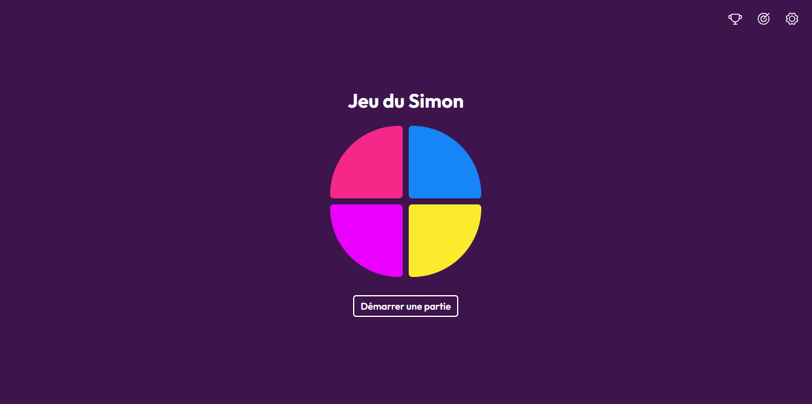
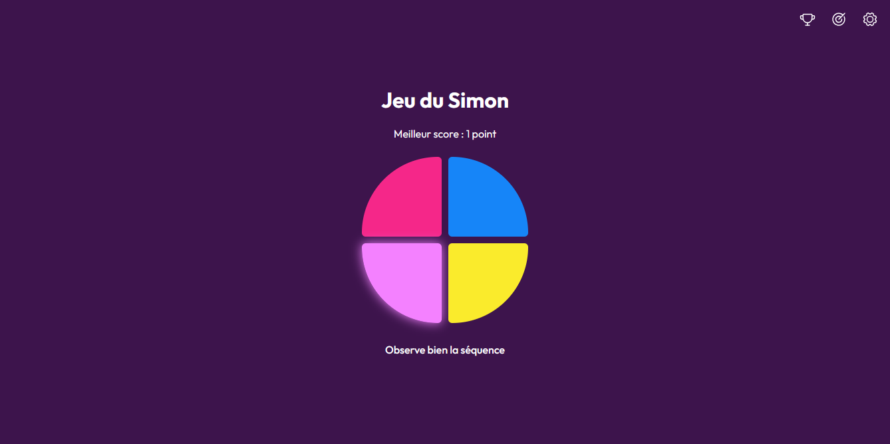

# Introduction

As part of a **project management course during our second year of Master's degree**, we had to improve and extend an existing project from the previous year.  
For this assignment, our group chose to enhance the **Simon Game PWA** originally developed during another course.  
This new version introduces significant improvements and new features.

## 📒 Index
- [About](#🔰-about)
- [Demo](#🚀-demo)
- [Stack](#🛠️-stack)
- [Features](#✨-features)
- [New Features](#🆕-new-features)
- [Timeline](#📅-timeline)
- [Gallery](#📷-gallery)

## 🔰 About
The Simon Game is a classic memory challenge where players must reproduce an increasingly complex sequence of colors.  
Each level adds one more color to the sequence, requiring focus, memorization, and quick reaction.

This enhanced version integrates new customization options, improved accessibility, new gameplay mechanics, and a modernized interface.

## 🚀 Demo
Try the demo here: [Simon Game](https://pwa-simon-game-2.vercel.app/)

## 🛠️ Stack
- **React** — Framework  
- **Vite** — Build tool  
- **Sass** — Styling  

## ✨ Features
The core features of the Simon Game include:
- **Color Sequences**: Randomly generated sequences the player must memorize and repeat.
- **Difficulty Curve**: The sequence grows longer and more complex as the player progresses.
- **Local Notifications**: Alerts the player when losing a game.
- **Haptic Feedback**: Vibration effects on mobile during sequence playback for a better tactile experience.

## 🆕 New Features
As part of the project management assignment, several major improvements were implemented:
- **Theme Customization**: Ability to switch between predefined color themes or create a fully custom theme. Each theme supports both light and dark modes.  
- **Enhanced Audio**: Sounds for each button, as well as victory and defeat feedback, with the option to disable all game sounds.  
- **Dynamic Game Speed**: Progressive acceleration of the sequence playback as the player reaches higher levels.  
- **High Score System**: A leaderboard to track and display the player's best performances.
- **Player Objectives**: The game now includes specific objectives for the player to achieve, such as reaching certain levels or completing sequences without mistakes.

## 📅 Timeline
This updated version of the project was completed at the end of **2025**.

## 📷 Gallery

