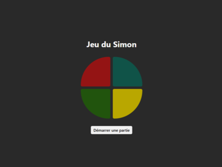
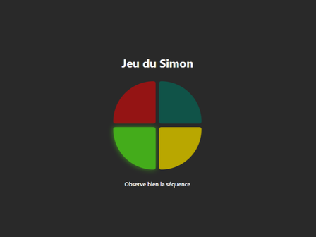

# Introduction

[Read in French - 🇫🇷](README_FR.md)

As a school project during my **first year of master's degree**, I developed a **Simon Game** as a **Progressive Web App (PWA)** using **React JS**.

## 📒 Index

- [About](#🔰-about)
- [Demo](#🚀-demo)
- [Stack](#🛠️-stack)
- [Features](#✨-features)
- [Timeline](#📅-timeline)
- [Gallery](#📷-gallery)

## 🔰 About

The Simon Game is a memory game where the user has to follow a sequence of colors that progressively becomes more complex. The goal is to correctly reproduce the sequence without making any mistakes, with increasing levels of difficulty.

## 🚀 Demo

Try the demo here: [Simon game](https://pwa-simon-game.vercel.app/)

## 🛠️ Stack

- **React** - Framework
- **Vite** - Build tool
- **Sass** - Styling

## ✨ Features

The app offers several features such as :

- **Color Sequences**: The game generates a random sequence of colors that the user has to memorize and repeat.
- **Difficulty Levels**: The more the user successfully reproduces the sequences, the harder the game becomes.
- **Local Notification**: A local notification is displayed when the user loses the game, alerting them of the result.
- **Vibration Effect**: A vibration occurs when the machine plays the color sequence, enhancing the user experience with haptic feedback.

## 📅 Timeline

This project was completed in **March 2025** as a school project.

## 📷 Gallery

