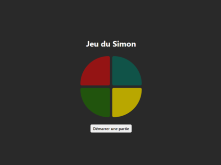
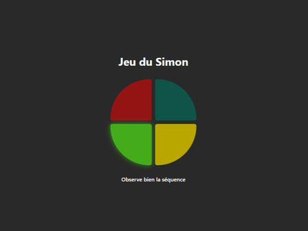

# Introduction

[Read the original - 🇬🇧](README.md)

Dans le cadre d'un projet scolaire de ma **première année de master**, j'ai développé un **Simon Game** sous forme d'une **Progressive Web App (PWA)** en utilisant **React JS**.

## 📒 Index

- [À propos](#🔰-à-propos)
- [Démo](#🚀-démo)
- [Technologies](#🛠️-technologies)
- [Fonctionnalités](#✨-fonctionnalités)
- [Timeline](#📅-timeline)
- [Galerie](#📷-galerie)

## 🔰 À propos

Le Simon Game est un jeu de mémoire où l'utilisateur doit suivre une séquence de couleurs qui devient progressivement plus complexe. L'objectif est de reproduire correctement la séquence sans faire d'erreurs, avec des niveaux de difficulté croissants.

## 🚀 Démo

Essaye la démo ici : [Simon Game](https://pwa-simon-game.vercel.app/)

## 🛠️ Technologies

- **React** - Framework
- **Vite** - Outil de construction
- **Sass** - Stylisation

## ✨ Fonctionnalités

L'application offre plusieurs fonctionnalités telles que :

- **Séquences de couleurs** : Le jeu génère une séquence aléatoire de couleurs que l'utilisateur doit mémoriser et répéter.
- **Niveaux de difficulté** : Plus l'utilisateur réussit à reproduire les séquences, plus le jeu devient difficile.
- **Notification locale** : Une notification locale est affichée lorsque l'utilisateur perd la partie, l'alertant du résultat.
- **Effet de vibration** : Une vibration se déclenche lorsque la machine joue la séquence de couleurs, améliorant l'expérience utilisateur avec un retour haptique.

## 📅 Timeline

Ce projet a été réalisé en **mars 2025** dans le cadre d'un projet scolaire.

## 📷 Galerie

